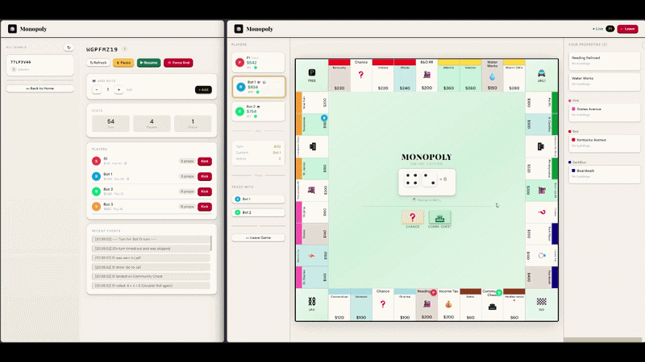

# Monopoly Online

A full-featured multiplayer Monopoly game built with ASP.NET Core 10, SignalR, and React — playable in the browser with up to four players per room. Complete classic ruleset including cards, trading, buildings, jail, and rent.



---

## Features

- **Real-time multiplayer** — SignalR keeps every client in sync with zero polling
- **Complete ruleset** — all 40 spaces, 32 cards (Chance + Community Chest), rent tables, monopoly bonuses, railroads, utilities, and jail mechanics
- **Trading system** — propose, counter, accept, or reject trades with properties and cash
- **Buildings** — buy houses and hotels per color group with full monopoly validation
- **Mortgage system** — mortgage and unmortgage properties for liquidity
- **Self-managed lobbies** — create a room, share the code, start when ready; host transfers automatically if the host leaves
- **Bot support** — fill empty seats with AI players
- **Turn timer** — auto-advance if a player idles too long
- **Event log** — toggleable live feed of every game action
- **Reconnect recovery** — drop and rejoin mid-game; full state is restored

---

## Tech Stack

| Layer | Technology |
|-------|------------|
| Server | ASP.NET Core 10 |
| Real-time transport | SignalR |
| Client | React (no bundler — plain script tags via Razor) |
| Host page | Razor Pages (`_Host.cshtml`) |
| State | In-memory (`Dictionary<string, GameState>`) |
| Serialisation | Strongly-typed DTOs, System.Text.Json |

---

## Getting Started

**Requirements:** .NET 10 SDK

```bash
git clone https://github.com/your-org/monopoly-online
cd monopoly-online
dotnet run --project MonopolyServer
```

Open `http://localhost:5000` in your browser. Create a room, share the URL with friends, and start the game when everyone has joined.

---

## Project Structure

```
MonopolyServer/
├── Models/                  # GameState, Player, Property, TradeOffer — data only
├── Engine/                  # GameEngine, CardDeckManager — all game rules
├── Services/
│   ├── GameRoomManager.cs   # Thread-safe singleton, single source of truth
│   ├── TradeService.cs      # Trade orchestration, decoupled from SignalR
│   └── GameCleanupService.cs# BackgroundService — purges stale rooms every 60 s
├── Hubs/
│   └── GameHub.cs           # SignalR hub — validate · delegate · broadcast only
├── DTOs/                    # GameStateDto, PlayerDto, TradeOfferDto, CardDto, …
├── Pages/
│   └── _Host.cshtml         # Razor shell; injects hub URL, loads React bundles
└── wwwroot/js/
    ├── constants.js          # SPACES, COLORS, BCOLORS
    ├── globals.js            # React hook aliases on window
    ├── animations.js         # usePlayerHop, useDiceRoll, DiceTray, ChestCardPopup
    ├── board.js              # Board component — 40-cell grid, tokens, scaled sizing
    ├── game_page.js          # GamePage — hub wiring, all game state
    ├── lobby.js              # LobbyPage, RoomPage
    └── app.js                # Root component and page router
```

---

## Architecture

See [ADR.md](ADR.md) for the full architecture decision record covering:

- **Concurrency model** — how `GameRoomManager` uses a single `_lock` to make compound game operations atomic, and why `ConcurrentDictionary` alone is insufficient
- **SignalR hub design** — thin hub pattern (validate · delegate · broadcast), group management, and the disconnect/reconnect lifecycle
- **React + Razor architecture** — how the Razor shell bootstraps React, the component tree, and why there is no build pipeline
- **Event subscription pattern** — how components subscribe in `useEffect` and always return unsubscribe functions to prevent listener leaks
- **Cleanup routine** — the `GameCleanupService` background timer and how `PurgeExpiredGames()` works under lock

---

## How a Turn Works

```
Player clicks Roll
  → gameHub.call('RollDice', gameId)
      → Hub validates it is the caller's turn
          → GameEngine.RollDice mutates GameState
              → Hub broadcasts GameStateUpdated + DiceRolled to all players
                  → React re-renders board, tokens, and cash
                  → Dice animation plays and settles on real values
```

The server is always the source of truth. The client never modifies game state locally — it waits for `GameStateUpdated` before re-rendering.

---

## Non-Features (Intentional)

- **No auctions** — property stays unowned if declined; auctions slow games down
- **No database** — in-memory only; a storage layer can be added without touching the engine
- **No admin powers** — host is a normal player; prevents lobby abuse
- **No roles or permissions** — everyone can create and host

---

## License

MIT